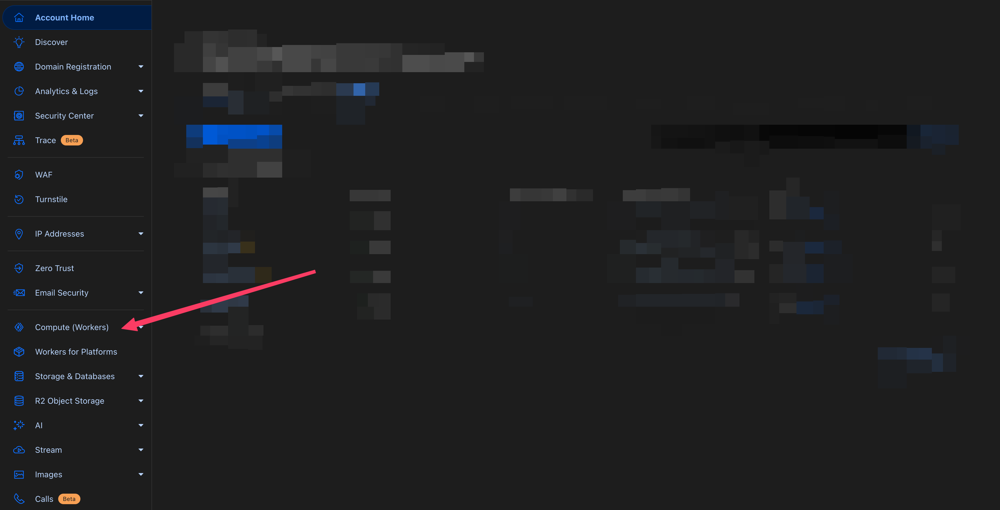
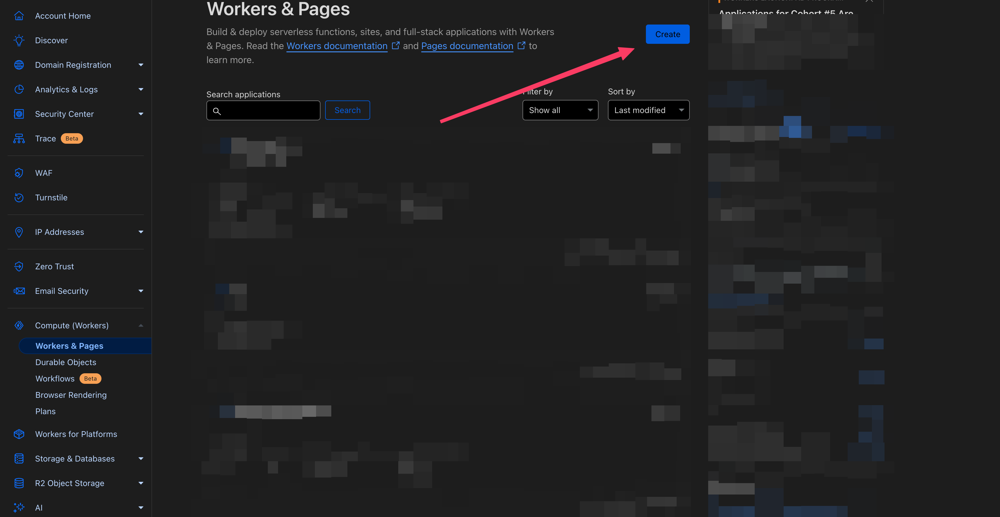
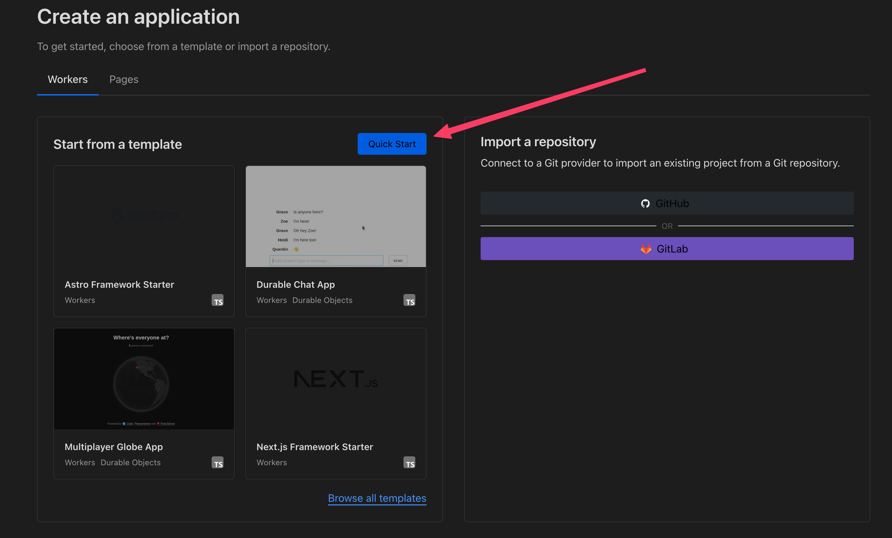
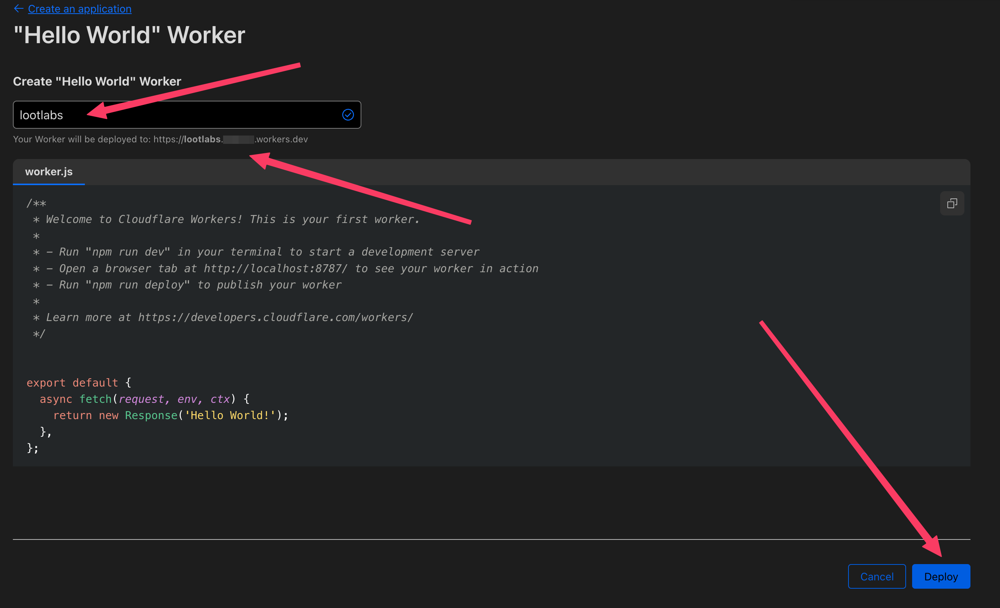
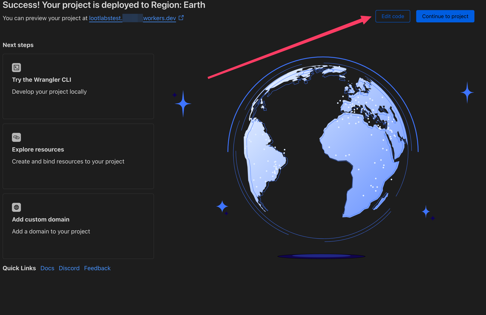
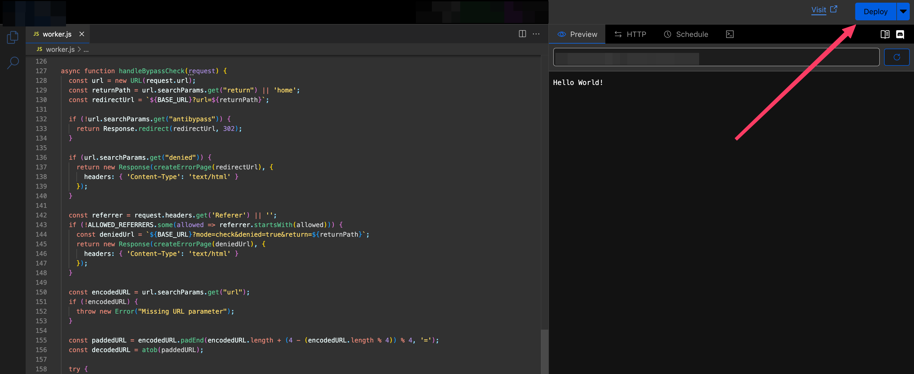

# Setup
###### From the creator of https://lootlabs.pages.dev.

## Need Help? I'll Set It Up for $5 in Crypto! 💰
If this setup feels overwhelming, I can help for just $5 in crypto. Ping me in the LootLabs Discord (@kbdevs) to get started.

---

## 📌 Setup Guide

### 1️⃣ Deploy on Cloudflare Workers
1. Log in to your [Cloudflare Dashboard](https://dash.cloudflare.com/).
2. Navigate to **Compute (Workers)**.

3. Click **Create**.

4. Ensure you're on the **Workers** tab.
5. Click **Quick Start**.

6. Name your worker something memorable (e.g. lootlabsapi)

7. Click **Edit code**

8. Replace all the code with **[script.js](https://raw.githubusercontent.com/kbdevs/lootlabs-antibypass/refs/heads/main/script.js?v=1)**
9. Click **Deploy**

10. Scroll to the top of script and customize it to your use.

## 🛠 Example Usage
If your deployed Worker URL is `https://yourworker.workers.dev/`, a typical request would be:

```
https://yourworker.workers.dev/?url=example
```

---